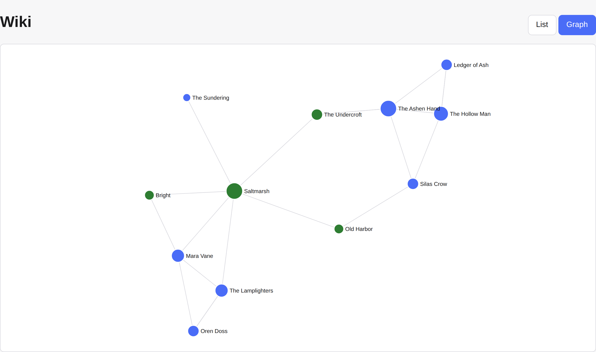
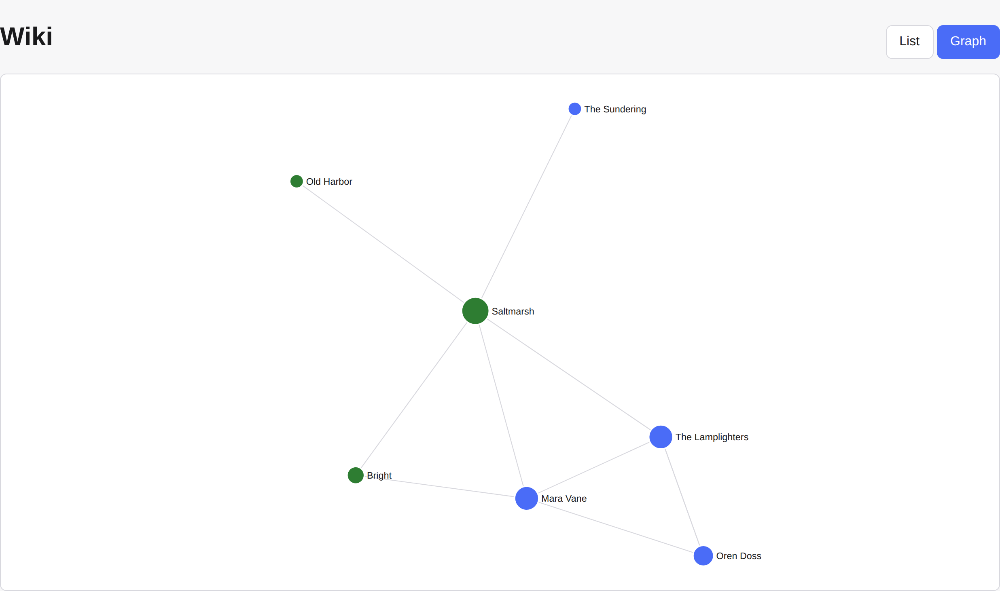

# CampaignSettings

A self-hosted web app for running tabletop RPG **campaign worlds** — a DM builds a
cross-linked wiki of NPCs, locations, organizations, and player characters, tracks
what surfaced in each session, and controls exactly what each player is allowed to
see. Multi-tenant, per-player visibility, single-process deploy behind Tailscale.

This is a scrubbed, fresh-history mirror of a private repo — no secrets or real
campaign data (`.env` and world DBs are gitignored and excluded from the mirror).

## Per-player visibility, made visible

The same world, the same graph view, two accounts — and **the server**, not the
browser, decides what each may fetch. The DM sees the full picture; an ungranted
player's graph simply does not contain the `dm_only` cabal or the `restricted`
informant, because the API never sends them.

| DM (`dm-demo`) — the whole world                                                                                                                              | Ungranted player (`player-scout`) — public layer only                                                                                                |
| ------------------------------------------------------------------------------------------------------------------------------------------------------------- | ---------------------------------------------------------------------------------------------------------------------------------------------------- |
|  |  |

Nodes are coloured by kind; edges are `[[wiki-links]]`. A _granted_ player
([`player-demo`](docs/img/graph-player-granted.png)) sees the public layer **plus**
exactly the one restricted character they hold a grant for — no more. Because the
graph is built from authorized rows only, an edge can never leak a hidden node; see
[Security model](#security-model) for how the one enforcement seam guarantees it.

## What it does

- **Worlds (multi-tenant).** An owner runs one or more worlds; each has a slug-based
  URL and its own members. Everything below is scoped to a world.
- **A dashboard on arrival.** Opening a world shows a role-aware home screen, not
  a list: the session you were last working on with everyone it involved, the party
  and who plays each character, and quick links into the kinds you reach for. A DM
  and a player see the same panels in a different order, and each sees only their
  own counts.
- **Entity wiki.** NPCs, PCs, locations, settlements, organizations, notes — a
  generic typed-entity model with `[[wiki-links]]`, backlinks, and a **force-directed
  graph view** of how entities connect. The searchable index and the graph live
  together under the world's **Wiki** rail link.
- **Typed relationships.** Beyond "this page mentions that one": a DM records that
  an NPC is a _member of_ an organization or an _ally of_ another NPC, from a fixed
  vocabulary. One row is stored per relationship and rendered from both ends, so the
  organization's page shows "has member" without a second row to keep in step.
- **Images and maps.** Images attach to any entity; a world holds maps that zoom and
  pan, with pins that stay anchored to the same point of the image at every scale
  because they are stored as fractions of the source rather than as pixels. A pin
  links to the entity it marks, and that entity's page lists the maps it appears on.
  A map has the same three visibility levels as everything else, so a splinter
  group's map can be shared with named players — and sharing the map does not
  share what is pinned on it.
- **Per-player visibility (the interesting bit).** A 3-state visibility model
  (`public` / `dm_only` / `restricted`, the last gated by a per-player grant ACL)
  decides what each player sees. The
  server enforces it at the data layer — a player literally cannot fetch a hidden
  entity, and export is owner-only. Proven with authz tests + Playwright e2e that
  drive a real player session.
- **Sessions.** Track play sessions and the entities "touched" in each.
- **Player suggestions.** A player suggests an addition from the page they are
  reading; it is visible to them and the GM alone until the GM publishes it at a
  visibility they choose, or declines it.
- **Accounts.** Registration with email verification, a forgot-password flow, and
  a self-service page for changing your password or username and revoking
  sessions on other devices. Deleting an account is refused while you still own a
  world, so a departing owner cannot take everyone else's campaign with them.
- **Membership.** An owner invites players by link or by looking up an existing
  account, manages the member list, and grants one player access to one
  restricted entity from that entity's page. A player can leave a world. An owner
  hands the world to someone else first, and that person has to accept.
- **Access gates.** Sign-in, signup, password reset, suggestions, account
  management, and demo mode are each an independent environment flag that fails
  closed. A gated surface refuses in the API, not just in the SPA, so a script
  cannot reach it either. Resource ceilings cap worlds per account, entities per
  world, and stored media per world.
- **World import/export.** Import an existing world from a legacy DM-tool SQLite
  format (`world-io` / `importer`); export is owner-gated.
- **Domain logic in `shared`.** Calendars, currency rules, settlement demographics,
  slugging, fuzzy search — pure, unit-tested, shared by server and web.

## Architecture

Every journey a person can take through the app — who can take it, what stops
it, and which test walks it — is inventoried in
[`docs/user-journeys.md`](docs/user-journeys.md).

A pnpm monorepo, three packages, one deployable process:

```
packages/
  shared/   pure domain logic + types (no IO) — imported by server AND web
  server/   Fastify API + Postgres (auth · authz · tenancy · wiki · sessions · import)
  web/      DOM-direct React SPA (no react-native-web; idiomatic JSX/DOM + CSS)
```

- **One process, one origin.** In production a single Node process serves both the
  API (`/api/*`) and the built SPA (`@fastify/static`, index.html fallback for
  client-side routes), bound to `127.0.0.1`. **Tailscale is the only ingress** — so
  the API client uses a relative `/api` base with `credentials: 'include'` and there
  is no CORS or base-URL configuration anywhere. See [`DEPLOY.md`](./DEPLOY.md).
- **Migrations on boot.** The server runs pending migrations at startup; no manual
  migrate step.
- **Auth** is hand-rolled scrypt (per-password salt, self-describing upgradable
  cost params, `timingSafeEqual`, fails-closed) behind a swappable `AuthService`
  interface — no auth library dependency.
- **Sans-IO domain core.** `shared` has no IO, so its logic is tested without a
  database; the DB-touching layers get their own integration tests against a real
  Postgres.

## Security model

Per-player visibility is the app's load-bearing invariant, so it is enforced in
**one server-side place** and proven by negative tests — never trusted to the UI.

- **One authorization seam.** Every content table is an instance of a single
  factory, [`createContentRepository`](./packages/server/src/authz/content.ts). Its
  private `visible()` query builder is the _only_ place the world-scope,
  soft-delete hiding, and the 3-state visibility read filter live
  (`public` → everyone; `restricted` → only a player holding a per-player grant in
  the `entity_visibility` ACL; `dm_only` → owner only). `get()`, `list()`,
  `update()`, and `softDelete()` all read through it, so no per-table or
  per-endpoint path can forget the check. A player fetching a hidden entity by id
  gets `undefined` → **HTTP 404**, not a 200 filtered in the browser.
- **Writes are owner-only, with exactly one exception.**
  [`assertContentWrite`](./packages/server/src/authz/content.ts) rejects any
  player mutation before it reaches the database. The single route that does not
  go through it is the propose endpoint, where a player suggests a passage — and
  it is narrow by construction: `status`, `author_id`, `visibility`, the
  per-player grant and the position are all set server-side from the
  authenticated actor and constants, so there is no field a client can send that
  changes who sees the result. A test posts every one of them and asserts each is
  ignored, and the surrounding refusals (a player cannot accept their own
  proposal, edit it, reject it, delete it, or grant it to anyone) are asserted
  alongside.
- **The graph cannot leak through an edge.** The wiki graph is built from
  authorized rows only, so an edge exists only when **both** endpoints are visible
  to the viewer ([`wiki/graph.ts`](./packages/server/src/wiki/graph.ts) — the
  both-endpoints rule falls out by construction). A player never sees a link that
  betrays a hidden node.
- **Player suggestions cannot smuggle privilege.** On accept, the suggestion flow
  strips `visibility` and the structural columns a player could neither see nor
  control (the `PROTECTED_FIELDS` set), then applies the update through the same
  seam ([`suggestions/suggestions.ts`](./packages/server/src/suggestions/suggestions.ts)).
- **A row that names two entities is filtered on both.** A map pin
  ([`data/map-pins.ts`](./packages/server/src/data/map-pins.ts)) and a typed
  relationship ([`data/relationships.ts`](./packages/server/src/data/relationships.ts))
  each name an entity other than their own owner, so the seam cannot filter them on
  their own behalf — a public map may carry a pin at a `dm_only` NPC, and the pin's
  free-text label spells out the secret whether or not the name is resolved. Both
  resolve every referenced entity through the seam and drop the row **whole**, label
  included, when one does not come back. It is the same rule the graph gets by
  construction, applied explicitly where it cannot be.
- **Three ACLs, one filter.** `restricted` rows are gated by a per-player grant,
  and the grant table is a PARAMETER of the seam rather than a constant
  ([`GrantTableSpec`](./packages/server/src/authz/content.ts)). Entities use
  `entity_visibility`, passages `passage_visibility`, maps `map_visibility` —
  each foreign-keyed to what it grants, and all three read by the same
  `visible()`. The alternative, a polymorphic `(kind, id)` ACL, would have cost
  those foreign keys; three narrow tables cost nothing but their own DDL, and
  the per-player decision still lives in exactly one place.
- **Staged reveal, without letting a hidden link become a visible edge.** An
  entity's prose is its base `description` plus any number of
  [passages](./packages/server/src/data/passages.ts), each carrying its own
  `public`/`dm_only`/`restricted` visibility, so a DM can reveal an NPC in
  stages instead of all at once. Passages ride the same seam — they carry
  `id`/`world_id`/`visibility`/`deleted_at`, which is all `ContentTableName`
  tests for — with their grants in `passage_visibility`, which is why the seam
  takes its ACL table as a parameter.
  Their subtlety is in the **graph**. Both-endpoints-visible used to be
  sufficient because the edge source text was a column on an authorized row.
  A `[[link]]` inside a `dm_only` passage on a _public_ NPC pointing at another
  _public_ entity defeats it: both endpoints are legitimately visible, and the
  secret is that the two are connected at all. So
  [`listBracketableEntities`](./packages/server/src/wiki/graph.ts) returns the
  viewer's **composed** text — a bracket inside a passage you cannot see is not
  in the text being parsed, and the edge cannot be built. Composition happens in
  exactly one place ([`data/passages.ts`](./packages/server/src/data/passages.ts));
  the API returns both `description` (raw, what the owner's editor edits) and
  `body` (composed, what every reader renders), and the SPA never composes.
  Graph **nodes** are deliberately unchanged: the graph ships only
  `{kind, id, name}`, so a node carries nothing to leak.
- **A player's suggestion needs no exception in the seam.** A proposed passage is
  `restricted` plus exactly one `passage_visibility` row naming its author — so
  the author sees it by the ordinary grant rule, the GM sees it because owners
  see everything, and every other player is excluded by the same rule that
  excludes them from any restricted row. There is no author clause in
  `visible()`; the design exists precisely so that none is needed. Accepting is
  the GM choosing a visibility and the self-grant being dropped, so access then
  comes from that visibility like anyone else's. Rejecting is a soft delete, so
  the record of a declined suggestion survives.

The enforcement is pinned by **negative-path tests** — the ones that assert a
player _cannot_ see or do something:

- [`authz/content.test.ts`](./packages/server/src/authz/content.test.ts) — a
  restricted row is hidden from an ungranted player, appears only after a grant and
  vanishes on revoke; a grant for one player never leaks to another; a grant never
  overrides `dm_only`; a grant is entity-specific; a player cannot
  create/update/delete or grant/revoke; and a cross-world tenancy wall holds.
- [`wiki/graph.test.ts`](./packages/server/src/wiki/graph.test.ts) — a `[[link]]`
  written inside a hidden passage produces **no edge** for a player, while both
  endpoint nodes stay visible to them; the edge follows a `restricted` passage's
  grant, appearing on grant and vanishing on revoke.
- [`http/http-passages.test.ts`](./packages/server/src/http/http-passages.test.ts) —
  a player's entity payload never contains a passage they may not read; an owner
  saving the description does not fold visible passages into the base column; a
  proposal is invisible to every player but its author; and a player is refused
  every action on a proposal except making one.
- [`e2e/specs/visibility.spec.ts`](./e2e/specs/visibility.spec.ts) — a real
  Playwright session logs in as an ungranted player and confirms the restricted
  entity is absent from both the entity list and the wiki.

## Try it — the 2-minute demo

The interesting feature — the server enforcing per-player visibility — is best
seen, not described. A seed script builds a small sample world ("Saltmarsh
Nights") with a public layer, a DM-only conspiracy, and one `restricted`
character revealed to a single player. Requires **Node ≥ 24**, **pnpm**, and
Docker.

```sh
corepack enable
pnpm install
docker compose up -d                     # Postgres on localhost:5433
cp .env.example .env                      # the default SESSION_SECRET is fine for local
echo 'LOGIN_ENABLED=true' >> .env         # sign-in is an access gate, and gates fail closed
export $(grep -v '^#' .env | xargs)       # main.ts reads the env, not .env

pnpm demo:seed                            # seed the sample world + demo accounts
pnpm --filter @campaign-settings/server start &   # API on :8787
pnpm --filter @campaign-settings/web dev          # SPA on :5173 (proxies /api)
```

Open **http://localhost:5173** and log in as each account the seed prints:

| Account        | Password               | Sees                                                            |
| -------------- | ---------------------- | --------------------------------------------------------------- |
| `dm-demo`      | `demo-dm-password`     | everything — the whole world                                    |
| `player-demo`  | `demo-player-password` | the public layer **plus** the restricted `Silas Crow` (granted) |
| `player-scout` | `demo-player-password` | the public layer **only** — no grant, no conspiracy             |

Open **Wiki** in the world's rail and switch it to **Graph** — the world root
itself is the dashboard, not the graph.

Watch the **graph view** redraw per account, and note that the DM-only nodes and
the un-granted character are not merely hidden in the UI — a player session
literally cannot fetch them from the API. `pnpm demo:seed` is idempotent (it
resets only the demo accounts), so re-run it any time.

## Developing

Requires **Node ≥ 24** and **pnpm** (via corepack). A local Postgres comes from
`compose.yaml`:

```sh
corepack enable
pnpm install
docker compose up -d                     # Postgres on localhost:5433
cp .env.example .env                      # then set SESSION_SECRET
pnpm check-all                            # typecheck · lint · format:check · test+coverage
pnpm e2e                                  # Playwright (chromium) end-to-end
```

`pnpm check-all` is the single source of truth for "green" — the same gate runs in
CI ([`.gitea/workflows/ci.yml`](./.gitea/workflows/ci.yml)) and in the local
pre-commit hook. The test suite sits around **99% line coverage**.

## Deploying

[`DEPLOY.md`](./DEPLOY.md) is the full ops runbook: Postgres, the environment file,
first-account creation, the SPA build, the systemd unit (`node --import tsx`, no
build step), and `tailscale serve` for HTTPS.

## License

MIT — see [LICENSE](./LICENSE).
